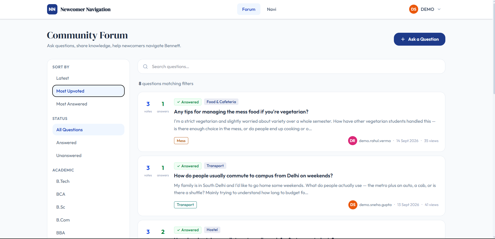
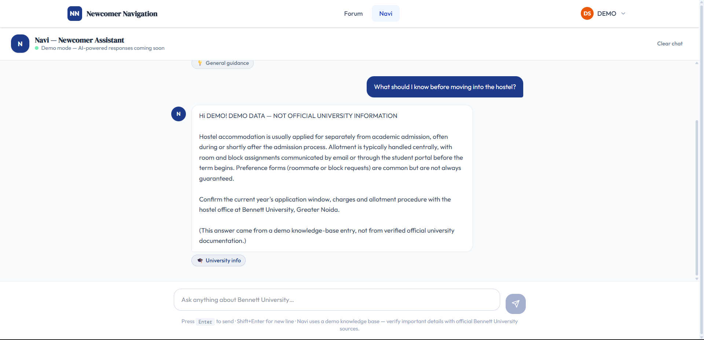
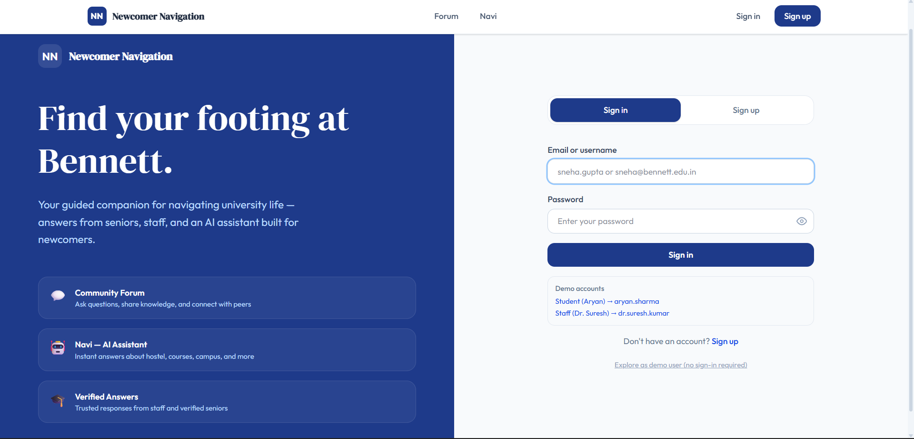
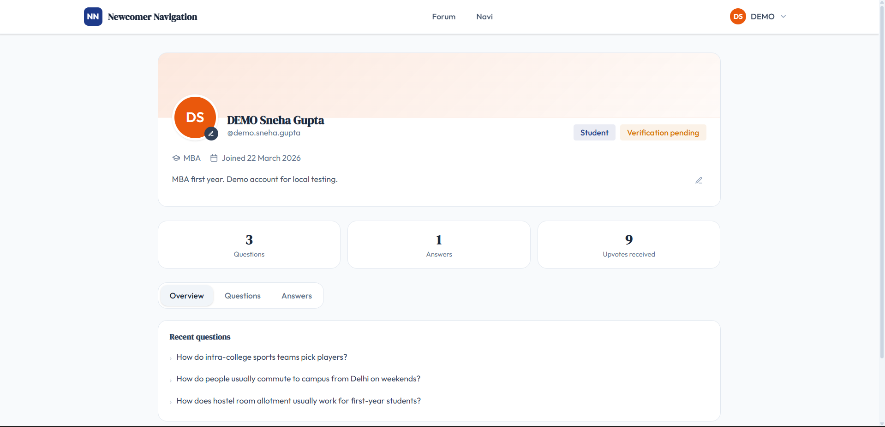

# Newcomer Navigator

A full-stack community platform for university newcomers, combining a Q&A forum, user profiles, voting, knowledge-base management, and **Navi**, a retrieval-based chatbot designed to prioritize trusted information over unsupported AI-generated answers.

## Highlights

* **Full-stack architecture** — React + TypeScript frontend with a FastAPI/Python backend
* **Authentication & authorization** — JWT-based sessions, password hashing, email verification, password reset, and ownership-based access control
* **AI integration** — Provider abstraction supporting OpenAI and Anthropic without exposing API credentials to the client
* **Retrieval-first chatbot** — Searches the university knowledge base before community answers, with general guidance only as a final fallback
* **Database-backed application** — SQLAlchemy ORM with Alembic migrations and SQLite support
* **Security-conscious design** — httpOnly authentication cookies, rate limiting, generic password-reset responses, and server-side permission checks
* **Automated testing** — Pytest coverage for authentication, profiles, forum functionality, voting, knowledge retrieval, and chatbot behavior
* **Responsive frontend** — React/TypeScript interface connected to the backend through a dedicated API service layer

## Architecture

                    ┌─────────────────────┐
                    │   React + TypeScript │
                    │      Frontend        │
                    └──────────┬──────────┘
                               │ REST API
                               ▼
                    ┌─────────────────────┐
                    │       FastAPI       │
                    │       Backend       │
                    └──────────┬──────────┘
                               │
              ┌────────────────┼────────────────┐
              ▼                ▼                ▼
        ┌───────────┐    ┌────────────┐   ┌──────────────┐
        │ SQLAlchemy│    │  Services  │   │     Auth     │
        │  + DB     │    │ Forum / AI │   │ JWT / bcrypt │
        └───────────┘    └─────┬──────┘   └──────────────┘
                               │
                         ┌─────▼─────┐
                         │ Retrieval │
                         │  Service  │
                         └─────┬─────┘
                               │
                    ┌──────────▼──────────┐
                    │   AI Provider       │
                    │ OpenAI / Anthropic  │
                    └─────────────────────┘

## Navi: Retrieval-First Chatbot

Navi does not send every question directly to an LLM.

The chatbot follows a three-stage retrieval strategy:

1. **University knowledge base**
2. **Community forum**
3. **General guidance**

The knowledge base is searched first. If no sufficiently relevant university information is found, the system searches community answers and selects the highest-rated relevant answer. Only when neither source contains useful information does it fall back to general guidance.

When an AI provider is enabled, the model is used to **rephrase retrieved context rather than act as the source of university-specific facts**.

The retrieval system uses lexical relevance scoring based on token overlap, with different weights for titles, tags, and body content.

## Security & Reliability

Security-sensitive behavior is implemented server-side rather than relying on the frontend.

Examples include:

* Passwords are hashed with bcrypt.
* Session tokens are stored in httpOnly cookies.
* Password-reset responses do not reveal whether an account exists.
* Verification and password-reset endpoints are rate-limited.
* Users can only edit their own profiles.
* Conversation access is scoped to the authenticated user.
* Vote totals are calculated server-side.
* AI credentials remain server-side and are never sent to the browser.
* The application can operate without an AI provider configured.

## Testing

The backend includes automated tests covering:

* Authentication and password handling
* Email verification
* Password reset flows
* Profile privacy and ownership
* Forum creation, editing and deletion
* Search, filtering and pagination
* Voting behavior
* Knowledge-base permissions and retrieval
* Chatbot source priority and relevance
* Conversation ownership
* AI-provider fallback behavior
* Security-related edge cases

Run the test suite with:

cd backend
pytest

## Tech Stack

**Frontend**

* React
* TypeScript
* Vite
* React Router
* Tailwind CSS

**Backend**

* Python
* FastAPI
* SQLAlchemy
* Pydantic
* Alembic

**Database**

* SQLite
* PostgreSQL-compatible architecture

**Authentication & Security**

* JWT
* bcrypt
* httpOnly cookies
* SlowAPI rate limiting

**AI**

* OpenAI API
* Anthropic API
* Custom retrieval/relevance layer

**Testing**

* Pytest

## Project Structure

Newcomer Navigator/
├── backend/
│   ├── app/
│   │   ├── api/          # API routes
│   │   ├── core/         # Cross-cutting concerns
│   │   ├── models/       # SQLAlchemy models
│   │   ├── schemas/      # Pydantic schemas
│   │   └── services/     # Business logic
│   ├── tests/             # Backend test suite
│   ├── alembic/           # Database migrations
│   ├── requirements.txt
│   └── README.md
│
├── figma uiux/
│   └── src/
│       ├── components/
│       ├── pages/
│       ├── services/
│       └── context/
│
└── main.py

## Running Locally

### Backend

cd backend
python -m venv .venv

# Windows
.venv\Scripts\activate

pip install -r requirements.txt

Create `.env` from `.env.example` and configure the required values.

Then:

alembic upgrade head
python seed.py
uvicorn app.main:app --reload --port 8000

### Frontend

cd "figma uiux"
pnpm install
pnpm run dev

The application runs locally on the configured frontend port and communicates with the FastAPI backend.

API documentation is available through FastAPI's generated documentation at:

http://localhost:8000/docs

## Demo Data

The repository contains demo data for development and testing. Demo knowledge-base content is explicitly labelled as non-official and should not be interpreted as verified university policy.

## Development Note

Generative AI tools were used during development for code generation, debugging, and documentation. The repository is intended to demonstrate the resulting application architecture, implementation, testing, and engineering decisions rather than claim that every line was manually written.
